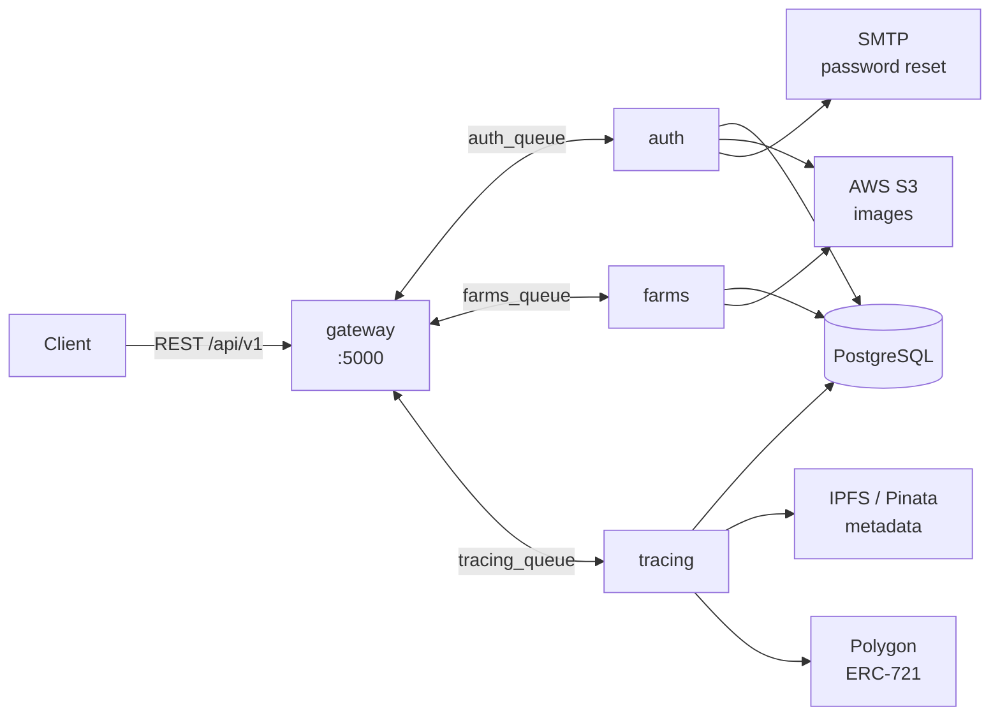

# HarvestLedger

An **agricultural traceability platform** built on NestJS microservices. It records a crop's full life cycle — sowing, treatments, harvest — and anchors that history in an immutable record: every farming event produces a new CID on IPFS, and the final harvest is minted as an ERC-721 NFT on Polygon.

The result is a verifiable chain of custody: a buyer can audit what was applied to a crop, when, and by whom, without having to take the producer's word for it.

---

## Why it's interesting

The substantial part isn't the CRUD — it's **how the metadata is chained**:

1. When traceability starts, the crop is serialized as NFT-style metadata and pinned to IPFS → yielding `CID₀`.
2. **Every recorded activity** (fertilizing, protection) fetches the current metadata, appends an attribute, and re-pins it → `CID₁`, `CID₂`, …
3. Registering the harvest repeats the process and mints the NFT, whose `tokenURI` points at the final CID.

Because IPFS is content-addressed, **any retroactive edit changes the hash** and breaks the chain. Immutability doesn't rest on trusting the backend.

---

## Architecture

Four independent NestJS services communicating over RabbitMQ in request/response mode. Only the gateway speaks HTTP.



| Service | Responsibility |
|---|---|
| **gateway** | The only HTTP surface. Validates, authenticates, and translates each request into a RabbitMQ message. Builds the exportable reports. |
| **auth** | Registration, login, JWT + refresh, password recovery by email, profile picture. |
| **farms** | Agricultural domain: farms, crops, activities, and harvests. The largest service. |
| **tracing** | Publishes metadata to IPFS and mints the harvest NFT on Polygon. |

`libs/common` holds the TypeORM entities, DTOs, guards, and shared modules (Postgres, RabbitMQ, S3, notifications).

### Domain model

```
User ──< Farm ──< Crop ──< Activity
                    └───── Harvest   (one per crop)
```

`Crop` is the pivot of the traceability chain: it stores `metadataLink` (the current IPFS CID) and `nftId` (the minted token, once harvested).

---

## Stack

**Backend** NestJS 10 (monorepo) · TypeScript · TypeORM · PostgreSQL
**Messaging** RabbitMQ (`amqplib`, `amqp-connection-manager`)
**Web3** ethers v6 · Polygon · ERC-721 (+ ERC-4906 for metadata updates)
**Storage** AWS S3 (images) · Pinata/IPFS (metadata)
**Other** JWT + bcrypt · Nodemailer + Handlebars · ExcelJS · Docker Compose

---

## Getting started

```bash
cp .env.example .env     # then fill in the values
docker compose up --build
```

| Service | URL |
|---|---|
| API | http://localhost:8086/api/v1 |
| Swagger | http://localhost:8086/api/docs |
| RabbitMQ console | http://localhost:15672 |
| pgAdmin | http://localhost:15432 |

Code documentation is generated with Compodoc:

```bash
pnpm install && pnpm doc
```

> The `tracing` service requires `WALLET_PRIVATE_KEY`, `CONTRACT_ADDRESS`, and `BLOCKCHAIN_RPC_URL`. Without them it fails fast at startup with an explicit message. The rest of the platform runs fine without any blockchain configuration.

---

## API

Every route is served under `/api/v1`. 🔒 = requires `Authorization: Bearer <token>`.

<details>
<summary><b>Authentication</b></summary>

| Method | Route | Description |
|---|---|---|
| POST | `auth/register` | Sign up |
| POST | `auth/login` | Log in → access (15m) + refresh (7d) |
| POST | `auth/refresh` | Reissue the access token |
| POST | `auth/forgot-password` | Sends an email with a 24h token |
| PATCH | `auth/reset-password` | Reset the password |
| POST | `auth/update` 🔒 | Update the profile |
| GET | `auth/user` 🔒 | Current profile |
| POST/GET | `auth/profile/photo` 🔒 | Profile picture |
</details>

<details>
<summary><b>Agricultural domain</b></summary>

| Method | Route | Description |
|---|---|---|
| POST/GET/PATCH/DELETE | `farms` 🔒 | Farm CRUD |
| POST/GET/PATCH/DELETE | `crops` 🔒 | Crop CRUD (`?farmId=`) |
| GET | `crops/findOne/:id` 🔒 | Crop detail |
| POST/GET/PATCH/DELETE | `activities` 🔒 | Activity CRUD (`?cropId=`) |
| POST/GET/PATCH/DELETE | `harvests` 🔒 | Harvest CRUD (`?cropId=`) |

Each resource also exposes `POST/GET .../photo` to upload and retrieve images (max 1 MB, `image/*` only).
</details>

<details>
<summary><b>Traceability and reports</b></summary>

| Method | Route | Description |
|---|---|---|
| PUT | `tracing/initTracing` 🔒 | Publishes the initial metadata to IPFS |
| POST | `tracing/updateTracing/:id` 🔒 | Uploads an image and mints the NFT once a harvest exists |
| GET | `report/admin` 🔒 | Global report (`admin` role only) |
| GET | `report/farmer/:id` 🔒 | The producer's own report |
</details>

---

## Layout

```
apps/
  gateway/    REST API · validation · Swagger · report generation
  auth/       users, JWT, email
  farms/      farms, crops, activities, harvests
  tracing/    IPFS + Polygon
libs/common/  entities, DTOs, guards, shared modules
```

---

## Project status

This project began as a startup product and is now a **personal lab for mastering distributed backend architecture** — the agricultural domain is the test bench, not the goal. **It is not production ready.** Today it is honestly a *distributed monolith*: four services and a broker, but a single shared database and a compile-time coupling between `tracing` and `farms`. Turning that into a genuinely distributed system is the whole point.

That's stated plainly because a repository honest about its limits says more than one that hides them.

## Roadmap

The full plan lives in [ROADMAP.md](./ROADMAP.md). In short, phased so each step leaves the system runnable and tested:

- **Phase 0 — Remove blockchain and IPFS.** The sector de-blockchained (IBM Food Trust withdrawn, Hyperledger Grid EOL, GS1 EPCIS 2.0 / W3C VC as the live token-free standards); the chained-CID history becomes an append-only events table in Postgres.
- **Phase 1 — Floor.** Tests + CI from commit 1, validation in the microservices (not just the gateway), a global exception filter, and security — resource-ownership (IDOR) checks first.
- **Phase 2 — Real boundaries.** Break the `tracing → farms` coupling, one database per service, real migrations (drop `synchronize: true`), a single data-access layer.
- **Phase 3 — Correctness under failure.** Ack-after-processing, outbox, idempotency, DLQ, sagas — the core of the learning.
- **Phase 4 — Observability.** Structured logging, correlation IDs, OpenTelemetry, metrics, health checks.
- **Phase 5 — Scale.** Load testing, fixing the report's N+1, caching, horizontal scaling.

---

## Architecture decisions — why blockchain was removed

The original design (NFT-style metadata chained on IPFS + an ERC-721 per harvest) was the pattern the industry retreated from between 2023 and 2026. Removing it is not fashion-driven contrarianism; it is what the evidence supports. The findings below come from adversarially verified research against primary sources.

### The sector de-blockchained

- **IBM Food Trust was withdrawn as a product.** `ibm.com/products/food-trust` now 301-redirects to the generic products index, and the whole `/products/blockchain-*` subtree collapses the same way. IBM Blockchain Platform reached end of support on 2023-04-30, and in January 2025 IBM published the withdrawal of the Supply Chain Intelligence Suite, which packaged Food Trust. Sources: [end-of-support notice](https://www.ibm.com/support/pages/ibm-blockchain-platform-software-reaches-end-support-april-30-2023), [withdrawal notice](https://www.ibm.com/support/pages/cloud-service-program-withdrawal-ibm-supply-chain-intelligence-suite-and-ibm-blockchain-transparent-supply-and-select-parts-withdrawal-ibm-sterling-order-management).
- **Provenance** — the most-cited blockchain food-traceability startup of 2015–2018 — is alive and operating, but its site now has **zero** mentions of blockchain; it repositioned as a product-claims platform. Source: [provenance.org](https://www.provenance.org/).
- **Farmer Connect**, which launched on IBM Food Trust, was acquired by Agridence in August 2025; `farmerconnect.com` 301-redirects to `agridence.com`, and the deal is framed as EUDR/DDS compliance SaaS with no blockchain mention. Source: [Baker McKenzie](https://www.bakermckenzie.com/en/newsroom/2025/08/agridence-acquires-farmer-connect).
- **Hyperledger Grid**, the flagship open-source supply-chain traceability framework, is End-of-Life and archived read-only since 2023-03-23. Sources: [hyperledger-archives/grid](https://github.com/hyperledger-archives/grid), [LFDT retrospective](https://www.lfdecentralizedtrust.org/blog/blockchain-pioneers-hyperledger-sawtooth-grid-and-transact).

### The live standards use neither tokens nor ledgers

- **GS1 EPCIS 2.0 / CBV 2.0** — the settled standard for supply-chain event data. Ratified June 2022, adopted as **ISO/IEC 19987:2024**, with JSON-LD, REST/OpenAPI, and GS1 Digital Link as first-class citizens. Sources: [gs1.org/standards/epcis](https://www.gs1.org/standards/epcis), [ISO/IEC 19987:2024](https://www.iso.org/standard/85557.html).
- **W3C Verifiable Credentials 2.0** — a finished web standard since 2025-05-15 (seven Recommendations). Its trust model is **signature-based**: integrity comes from cryptographic proofs on the credential, never from on-chain issuance. Sources: [W3C press release](https://www.w3.org/press-releases/2025/verifiable-credentials-2-0/), [VC Data Model 2.0](https://www.w3.org/TR/vc-data-model-2.0/).
- **UN/CEFACT UNTP** is built on VCs and DIDs (`did:web`/`did:webvh`) and **explicitly declines** token/ledger designs — design requirement VC-08: "avoid driving users towards closed ecosystems or proprietary ledgers." Source: [untp.unece.org](https://untp.unece.org/docs/specification/).

### The honest caveat — don't over-correct

GS1's own [Feb 2025 technical landscape report](https://ref.gs1.org/docs/2025/VCs-and-DIDs-tech-landscape) calls the VC/DID ecosystem fragmented with "no dominant approach or widespread adoption" and advises to "proceed with caution." The W3C CCG traceability-interop profile is a Community Group Final Report, not a W3C Standard. The defensible 2026 position: **EPCIS 2.0 is settled; VCs are ratified but immature in deployment; tokens are part of neither story.**

### What IPFS actually gives — and what replaces it here

IPFS's own docs state it plainly: *"While IPFS guarantees that any content on the network is discoverable, it doesn't guarantee that any content is persistently available"* ([docs.ipfs.tech](https://docs.ipfs.tech/concepts/persistence/)). A CID gives **integrity** (bytes can't change silently under the same CID) but **not persistence** — that depends on someone continuing to pay for pinning.

The genuinely defensible way to get tamper-evidence without a blockchain is the **transparency-log (tlog) model**: append-only Merkle trees with inclusion and consistency proofs ([RFC 6962](https://www.rfc-editor.org/rfc/rfc6962.html)/[RFC 9162](https://www.rfc-editor.org/rfc/rfc9162.html)), in production behind Certificate Transparency, [Trillian](https://transparency.dev/verifiable-data-structures/), and [Sigstore Rekor](https://docs.sigstore.dev/logging/overview/) (used by PyPI and npm). The caveat that must travel with it: a tlog is tamper-**evident**, not tamper-**proof** — its guarantee is conditional on monitors/witnesses comparing signed tree heads. That residual gap (the split-view attack) is exactly what a public blockchain's consensus closes by construction. Knowing precisely what a ledger buys and what it doesn't is the point.

For this lab, the chained-CID history collapses to an **append-only events table in Postgres** — the auditable property kept, the external dependency dropped. A signed Merkle log over those events is a natural later exercise, not a requirement.

### Regulatory context (time-sensitive)

- **EUDR** applies from **30 December 2026** (Regulation (EU) 2025/2650); it has already slipped twice.
- **FSMA Rule 204** is genuinely unresolved: the extension to July 2028 was only *proposed*, and as of mid-2026 no final rule had published while the original January 2026 date lapsed.

---

## License

No usage license. The code is published for portfolio and reference purposes; no rights of use, copying, or distribution are granted.
