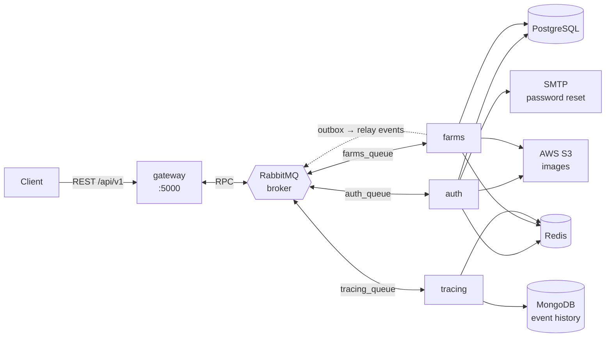

# HarvestLedger

[](https://github.com/RookieCol/harvestledger/actions/workflows/ci.yml)

A NestJS microservices backend for **agricultural traceability** — it records a crop's full life cycle (sowing, treatments, harvest) as an auditable history.

It began as a startup product and is now a **personal lab for mastering distributed backend architecture**. The agricultural domain is the test bench; the real subject is the backend. This README covers where it came from, what it is today, and where it's going.

> ### At a glance
> - **Was** — a blockchain traceability product: crop metadata chained on IPFS (one new CID per farming event), one ERC-721 minted per harvest on Polygon.
> - **Is** — **Phases 0–4 done** and **Phase 5 under way**. Blockchain/IPFS removed (`tracing` is a MongoDB event history); tests + CI, cross-service validation and coherent errors, resource-ownership security, and **reliable messaging** (ack-after-processing, retry + DLQ, Redis-backed idempotency); the schema owned by **TypeORM migrations**; running on a **Kubernetes** (kind) cluster with health probes, HPA and a Helm chart; **observability** — structured logs, Prometheus + Grafana metrics, and **distributed tracing** (OpenTelemetry + Jaeger) — and **load-tested** with k6. Phase 5 so far adds distributed tracing and a **transactional outbox**. Still a *distributed monolith* in one respect: `auth`/`farms` share one PostgreSQL instance (one-DB-per-service is the next Phase 5 step). **Not production ready**, and it says so.
> - **Going** — the rest of Phase 5: one database per service and a new service to exercise the topology. Full plan in [ROADMAP.md](./ROADMAP.md).

---

## Where it came from

The original pitch was the traceability chain: each activity fetched the crop's current metadata, appended an attribute, and re-pinned it to IPFS, yielding a new content-addressed CID; the harvest was minted as an NFT whose `tokenURI` pointed at the final CID. The idea was that immutability wouldn't rest on trusting the backend.

That is the pattern the industry retreated from between 2023 and 2026 — and, more precisely, "metadata on IPFS ⇒ immutable" conflates two different properties (a CID gives integrity, not availability). Both are documented, with primary sources, in [Architecture decisions](#architecture-decisions--why-blockchain-was-removed) below. **Phase 0 has removed this layer**: `tracing` no longer touches IPFS/Polygon and now owns an append-only event history in MongoDB, described below.

---

## Architecture (current)

Four NestJS services communicating over RabbitMQ; only the gateway speaks HTTP. **Polyglot persistence:** PostgreSQL for the relational domain, MongoDB for the traceability event history, Redis for idempotency / refresh-token rotation / report cache. `tracing` runs against its own MongoDB; `farms` feeds it through a **transactional outbox** — a crop/activity/harvest and its event are written in one Postgres transaction, and a relay drains the outbox to RabbitMQ, so an event is never lost to a failed publish. The one boundary the roadmap still addresses (dashed): `auth` and `farms` share **one** PostgreSQL instance.



Every service exports OpenTelemetry traces to Jaeger and (the gateway) Prometheus metrics to Grafana — a single request is one trace spanning gateway → auth/farms → Postgres. See [k8s/monitoring](./k8s/monitoring).

| Service | Responsibility |
|---|---|
| **gateway** | The only HTTP surface. Validates, authenticates, and translates each request into a RabbitMQ message. Builds the exportable reports. Exposes `/metrics`. |
| **auth** | Registration, login, JWT + refresh, password recovery by email, profile picture. Owns running the TypeORM migrations on startup. |
| **farms** | Agricultural domain: farms, crops, activities, and harvests. The largest service. Records each creation to a **transactional outbox** and relays it to `tracing`. |
| **tracing** | Owns the append-only traceability event history in MongoDB. A pure, **idempotent** event sink: consumes `crop.initialized`/`activity.created`/`harvest.created` and exposes a read endpoint over a crop's history. |

`libs/common` holds the TypeORM entities and migrations, Mongoose schemas, DTOs, guards, and shared modules (Postgres, MongoDB, RabbitMQ, Redis, S3, notifications, logging, metrics, tracing).

### Domain model

```
User ──< Farm ──< Crop ──< Activity
                    └───── Harvest   (one per crop)
```

`Crop` is the pivot of the traceability chain. Every crop, activity, and harvest creation produces one document in the MongoDB event history, keyed by `cropId`.

---

## Stack

| Layer | Technologies |
|---|---|
| **Backend** | NestJS 10 (monorepo) · TypeScript · TypeORM (+ migrations) · PostgreSQL · Mongoose · MongoDB · Redis (`ioredis`) |
| **Messaging** | RabbitMQ (`amqplib`, `amqp-connection-manager`) · transactional outbox (`@nestjs/schedule`) |
| **Infra** | Docker (multi-stage) · Kubernetes (kind) · Helm · ingress-nginx + cert-manager (TLS) |
| **Observability** | `nestjs-pino` (structured logs) · Prometheus + Grafana · OpenTelemetry + Jaeger (distributed tracing) · k6 (load testing) |
| **Storage** | AWS S3 (images) — MinIO locally as an S3-compatible dev replacement |
| **Other** | JWT + bcrypt · Nodemailer + Handlebars · ExcelJS · Docker Compose |

---

## Getting started

```bash
cp .env.example .env     # then fill in the values
docker compose up --build
```

| Service | URL |
|---|---|
| API | http://localhost:8086/api/v1 |
| Swagger | http://localhost:8086/api/docs |
| RabbitMQ console | http://localhost:15672 |
| pgAdmin | http://localhost:15432 |
| MinIO console | http://localhost:9001 |

To run the full stack on a local **Kubernetes** (kind) cluster instead — images, StatefulSet backends, health probes, HPA and ingress — follow [k8s/README.md](./k8s/README.md); bring up Prometheus + Grafana + Jaeger with [k8s/monitoring/README.md](./k8s/monitoring/README.md).

The observability stack runs **only on Kubernetes** (distributed tracing is a no-op unless `OTEL_EXPORTER_OTLP_ENDPOINT` is set, which the cluster ConfigMap does). Reach the dashboards over `kubectl port-forward`:

| Tool | URL |
|---|---|
| Grafana (metrics dashboards) | http://localhost:3001 |
| Prometheus | http://localhost:9090 |
| Jaeger (distributed traces) | http://localhost:16686 |

Code documentation is generated with Compodoc:

```bash
pnpm install && pnpm doc
```

---

## API

Every route is served under `/api/v1`. 🔒 = requires `Authorization: Bearer <token>`.

<details>
<summary><b>Authentication</b></summary>

| Method | Route | Description |
|---|---|---|
| POST | `auth/register` | Sign up |
| POST | `auth/login` | Log in → access (15m) + refresh (7d) |
| POST | `auth/refresh` | Reissue the access token |
| POST | `auth/forgot-password` | Sends an email with a 24h token |
| PATCH | `auth/reset-password` | Reset the password |
| POST | `auth/update` 🔒 | Update the profile |
| GET | `auth/user` 🔒 | Current profile |
| POST/GET | `auth/profile/photo` 🔒 | Profile picture |
</details>

<details>
<summary><b>Agricultural domain</b></summary>

| Method | Route | Description |
|---|---|---|
| POST/GET/PATCH/DELETE | `farms` 🔒 | Farm CRUD |
| POST/GET/PATCH/DELETE | `crops` 🔒 | Crop CRUD (`?farmId=`) |
| GET | `crops/findOne/:id` 🔒 | Crop detail |
| POST/GET/PATCH/DELETE | `activities` 🔒 | Activity CRUD (`?cropId=`) |
| POST/GET/PATCH/DELETE | `harvests` 🔒 | Harvest CRUD (`?cropId=`) |

Each resource also exposes `POST/GET .../photo` to upload and retrieve images (max 1 MB, `image/*` only).
</details>

<details>
<summary><b>Traceability and reports</b></summary>

| Method | Route | Description |
|---|---|---|
| GET | `tracing/history/:cropId` 🔒 | The crop's append-only event history (crop init, activities, harvests), ordered by time |
| GET | `report/admin` 🔒 | Global report (`admin` role only) |
| GET | `report/farmer/:id` 🔒 | The producer's own report |
</details>

---

## Layout

```
apps/
  gateway/    REST API · validation · Swagger · report generation · /metrics
  auth/       users, JWT, email · runs the DB migrations
  farms/      farms, crops, activities, harvests · transactional outbox + relay
  tracing/    MongoDB-backed traceability event history (idempotent sink)
libs/common/  entities + migrations, schemas, DTOs, guards, shared modules
              (Postgres, Mongo, RabbitMQ, Redis, S3, logging, metrics, tracing)
k8s/          raw manifests · monitoring/ (Prometheus, Grafana, Jaeger)
helm/         Helm chart for the same stack
load/k6/      k6 load test
```

---

## Progress & what's next

Four concrete goals drove the work: make it **stable**, make progress **visible**, practice **Kubernetes**, and **load-test** it — with **polyglot persistence** (PostgreSQL + MongoDB + Redis, each where it fits) running across them. Phases 0–4 are done and Phase 5 is under way. The full plan lives in [ROADMAP.md](./ROADMAP.md); each phase leaves the system runnable and tested, and every slice was verified on a live kind cluster with green CI. See [CHANGELOG.md](./CHANGELOG.md) for the per-slice log.

- **✅ Phase 0 — Remove blockchain and IPFS.** The sector de-blockchained (IBM Food Trust withdrawn, Hyperledger Grid EOL, GS1 EPCIS 2.0 / W3C VC as the live token-free standards); the chained-CID history is now an append-only event history in **MongoDB**, owned by `tracing`.
- **✅ Phase 1 — Stable.** Tests + CI from commit 1, validation in the microservices (not just the gateway), a global exception filter, security (resource-ownership / IDOR first), reliable messaging (ack-after-processing, DLQ, retries, Redis-backed idempotency), and the schema owned by TypeORM migrations.
- **✅ Phase 2 — Progress made visible.** Green CI + coverage badges, clean multi-stage images.
- **✅ Phase 3 — Kubernetes.** Hardened images, health/readiness probes, manifests then a Helm chart, on a local kind cluster with an HPA and ingress-nginx + cert-manager TLS; `docker-compose` stays for local dev.
- **✅ Phase 4 — Load & observability.** k6 load tests, structured logging + Prometheus/Grafana metrics, a Redis cache and an N+1 fix on the report — measured before/after ([results below](#load-test-results)).
- **🔄 Phase 5 — Distributed expansion** (optional, gated behind stability):
  - ✅ **Distributed tracing** — OpenTelemetry across all services, exported to Jaeger; context propagates through RabbitMQ automatically.
  - ✅ **Transactional outbox** — `farms → tracing` events written atomically with the domain row and relayed out-of-band, so a failed publish can't lose an event.
  - ⬜ **One database per service** — split the Postgres shared by `auth`/`farms`; cross-context data travels by message.
  - ⬜ **A new service** — introduced to exercise the topology (e.g. notifications).

**Out of scope** unless a concrete need appears: event sourcing, CQRS, full sagas (the Phase 5 outbox covers cross-service write consistency without them).

### Load test results

k6 against the gateway on the kind cluster — login once, then hammer the read path (`GET /farms` → gateway → farms over RabbitMQ → Postgres), ramping to 60 virtual users. Full procedure in [k8s/monitoring/README.md](./k8s/monitoring/README.md).

| Metric | Result |
|---|---|
| Total requests | **24,211** |
| Throughput | **~179 req/s** |
| Failed requests | **0** (0.00%) |
| Latency p95 | **67 ms** |
| Autoscaling | gateway **2 → 5** replicas (CPU-based HPA) |
| Threshold `http_req_failed` | `< 5%` — ✅ met |
| Threshold `p95` | `< 800 ms` — ✅ met (67 ms) |

Prometheus (scraping every pod via `kubernetes_sd`) counted **24,435** requests, matching the client side across all HPA replicas.

---

## Architecture decisions — why blockchain was removed

The original design (NFT-style metadata chained on IPFS + an ERC-721 per harvest) was the pattern the industry retreated from between 2023 and 2026. Removing it is not fashion-driven contrarianism; it is what the evidence supports. The findings below come from adversarially verified research against primary sources — the full study, with confidence levels and refuted claims, is in [docs/research/2026-07-agrifood-traceability-landscape.md](./docs/research/2026-07-agrifood-traceability-landscape.md).

### The sector de-blockchained

- **IBM Food Trust was withdrawn as a product.** `ibm.com/products/food-trust` now 301-redirects to the generic products index, and the whole `/products/blockchain-*` subtree collapses the same way. IBM Blockchain Platform reached end of support on 2023-04-30, and in January 2025 IBM published the withdrawal of the Supply Chain Intelligence Suite, which packaged Food Trust. Sources: [end-of-support notice](https://www.ibm.com/support/pages/ibm-blockchain-platform-software-reaches-end-support-april-30-2023), [withdrawal notice](https://www.ibm.com/support/pages/cloud-service-program-withdrawal-ibm-supply-chain-intelligence-suite-and-ibm-blockchain-transparent-supply-and-select-parts-withdrawal-ibm-sterling-order-management).
- **Provenance** — the most-cited blockchain food-traceability startup of 2015–2018 — is alive and operating, but its site now has **zero** mentions of blockchain; it repositioned as a product-claims platform. Source: [provenance.org](https://www.provenance.org/).
- **Farmer Connect**, which launched on IBM Food Trust, was acquired by Agridence in August 2025; `farmerconnect.com` 301-redirects to `agridence.com`, and the deal is framed as EUDR/DDS compliance SaaS with no blockchain mention. Source: [Baker McKenzie](https://www.bakermckenzie.com/en/newsroom/2025/08/agridence-acquires-farmer-connect).
- **Hyperledger Grid**, the flagship open-source supply-chain traceability framework, is End-of-Life and archived read-only since 2023-03-23. Sources: [hyperledger-archives/grid](https://github.com/hyperledger-archives/grid), [LFDT retrospective](https://www.lfdecentralizedtrust.org/blog/blockchain-pioneers-hyperledger-sawtooth-grid-and-transact).

### The live standards use neither tokens nor ledgers

- **GS1 EPCIS 2.0 / CBV 2.0** — the settled standard for supply-chain event data. Ratified June 2022, adopted as **ISO/IEC 19987:2024**, with JSON-LD, REST/OpenAPI, and GS1 Digital Link as first-class citizens. Sources: [gs1.org/standards/epcis](https://www.gs1.org/standards/epcis), [ISO/IEC 19987:2024](https://www.iso.org/standard/85557.html).
- **W3C Verifiable Credentials 2.0** — a finished web standard since 2025-05-15 (seven Recommendations). Its trust model is **signature-based**: integrity comes from cryptographic proofs on the credential, never from on-chain issuance. Sources: [W3C press release](https://www.w3.org/press-releases/2025/verifiable-credentials-2-0/), [VC Data Model 2.0](https://www.w3.org/TR/vc-data-model-2.0/).
- **UN/CEFACT UNTP** is built on VCs and DIDs (`did:web`/`did:webvh`) and **explicitly declines** token/ledger designs — design requirement VC-08: "avoid driving users towards closed ecosystems or proprietary ledgers." Source: [untp.unece.org](https://untp.unece.org/docs/specification/).

### The honest caveat — don't over-correct

GS1's own [Feb 2025 technical landscape report](https://ref.gs1.org/docs/2025/VCs-and-DIDs-tech-landscape) calls the VC/DID ecosystem fragmented with "no dominant approach or widespread adoption" and advises to "proceed with caution." The W3C CCG traceability-interop profile is a Community Group Final Report, not a W3C Standard. The defensible 2026 position: **EPCIS 2.0 is settled; VCs are ratified but immature in deployment; tokens are part of neither story.**

### What IPFS actually gives — and what replaces it here

IPFS's own docs state it plainly: *"While IPFS guarantees that any content on the network is discoverable, it doesn't guarantee that any content is persistently available"* ([docs.ipfs.tech](https://docs.ipfs.tech/concepts/persistence/)). A CID gives **integrity** (bytes can't change silently under the same CID) but **not persistence** — that depends on someone continuing to pay for pinning.

The genuinely defensible way to get tamper-evidence without a blockchain is the **transparency-log (tlog) model**: append-only Merkle trees with inclusion and consistency proofs ([RFC 6962](https://www.rfc-editor.org/rfc/rfc6962.html)/[RFC 9162](https://www.rfc-editor.org/rfc/rfc9162.html)), in production behind Certificate Transparency, [Trillian](https://transparency.dev/verifiable-data-structures/), and [Sigstore Rekor](https://docs.sigstore.dev/logging/overview/) (used by PyPI and npm). The caveat that must travel with it: a tlog is tamper-**evident**, not tamper-**proof** — its guarantee is conditional on monitors/witnesses comparing signed tree heads. That residual gap (the split-view attack) is exactly what a public blockchain's consensus closes by construction. Knowing precisely what a ledger buys and what it doesn't is the point.

For this lab, the chained-CID history collapses to an **append-only event history in MongoDB** — the auditable property kept, the external dependency dropped. A signed Merkle log over those events is a natural later exercise, not a requirement.

### Regulatory context (time-sensitive)

- **EUDR** applies from **30 December 2026** (Regulation (EU) 2025/2650); it has already slipped twice.
- **FSMA Rule 204** is genuinely unresolved: the extension to July 2028 was only *proposed*, and as of mid-2026 no final rule had published while the original January 2026 date lapsed.

---

## License

No usage license. The code is published for portfolio and reference purposes; no rights of use, copying, or distribution are granted.
