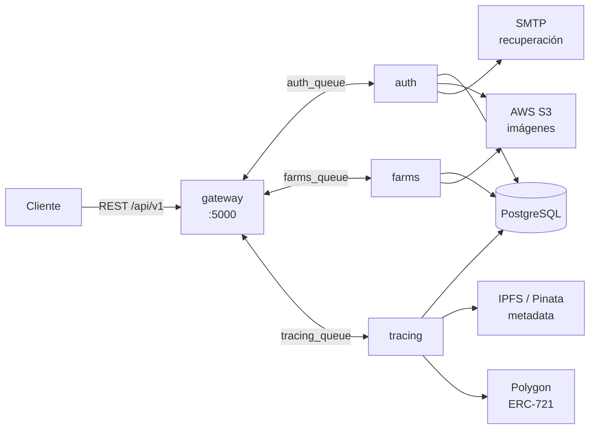

# HarvestLedger

Plataforma de **trazabilidad agrícola** construida sobre microservicios NestJS. Registra el ciclo de vida completo de un cultivo —siembra, tratamientos, cosecha— y ancla esa historia en un registro inmutable: cada evento agrícola genera un nuevo CID en IPFS, y la cosecha final se acuña como un NFT ERC-721 en Polygon.

El resultado es una cadena de custodia verificable: un comprador puede auditar qué se le aplicó a un cultivo, cuándo y por quién, sin depender de la palabra del productor.

---

## Por qué es interesante

La parte técnicamente sustanciosa no es el CRUD, sino **cómo se encadena la metadata**:

1. Al iniciar la trazabilidad, el cultivo se serializa como metadata estilo NFT y se sube a IPFS → se obtiene un `CID₀`.
2. **Cada actividad registrada** (fertilización, protección) descarga la metadata vigente, le añade un atributo y la vuelve a subir → `CID₁`, `CID₂`, …
3. Al registrar la cosecha se repite el proceso y se acuña el NFT, cuyo `tokenURI` apunta al CID final.

Como IPFS direcciona por contenido, **cualquier alteración retroactiva cambia el hash** y rompe la cadena. La inmutabilidad no depende de confiar en el backend.

---

## Arquitectura

Cuatro servicios NestJS independientes que se comunican por RabbitMQ en modo request/response. Sólo el gateway expone HTTP.



| Servicio | Responsabilidad |
|---|---|
| **gateway** | Única superficie HTTP. Valida, autentica y traduce cada petición a un mensaje RabbitMQ. Genera los reportes exportables. |
| **auth** | Registro, login, JWT + refresh, recuperación de contraseña por email, foto de perfil. |
| **farms** | Dominio agrícola: granjas, cultivos, actividades y cosechas. Es el servicio más grande. |
| **tracing** | Publicación de metadata en IPFS y acuñación del NFT de cosecha en Polygon. |

`libs/common` concentra entidades TypeORM, DTOs, guards y los módulos compartidos (Postgres, RabbitMQ, S3, notificaciones).

### Modelo de dominio

```
User ──< Farm ──< Crop ──< Activity
                    └───── Harvest   (una por cultivo)
```

`Crop` es la entidad pivote de la trazabilidad: guarda `metadataLink` (el CID vigente en IPFS) y `nftId` (el token acuñado, si ya se cosechó).

---

## Stack

**Backend** NestJS 10 (monorepo) · TypeScript · TypeORM · PostgreSQL
**Mensajería** RabbitMQ (`amqplib`, `amqp-connection-manager`)
**Web3** ethers v6 · Polygon · ERC-721 (+ ERC-4906 para actualización de metadata)
**Almacenamiento** AWS S3 (imágenes) · Pinata/IPFS (metadata)
**Otros** JWT + bcrypt · Nodemailer + Handlebars · ExcelJS · Docker Compose

---

## Puesta en marcha

```bash
cp .env.example .env     # y rellena los valores
docker compose up --build
```

| Servicio | URL |
|---|---|
| API | http://localhost:8086/api/v1 |
| Swagger | http://localhost:8086/api/docs |
| RabbitMQ (consola) | http://localhost:15672 |
| pgAdmin | http://localhost:15432 |

Documentación de código generada con Compodoc:

```bash
pnpm install && pnpm doc
```

> El servicio `tracing` requiere `WALLET_PRIVATE_KEY`, `CONTRACT_ADDRESS` y `BLOCKCHAIN_RPC_URL`. Sin ellas falla al arrancar con un mensaje explícito. El resto de la plataforma funciona sin configuración blockchain.

---

## API

Todas las rutas cuelgan de `/api/v1`. 🔒 = requiere `Authorization: Bearer <token>`.

<details>
<summary><b>Autenticación</b></summary>

| Método | Ruta | Descripción |
|---|---|---|
| POST | `auth/register` | Registro |
| POST | `auth/login` | Login → access (15m) + refresh (7d) |
| POST | `auth/refresh` | Reemitir access token |
| POST | `auth/forgot-password` | Envía email con token de 24h |
| PATCH | `auth/reset-password` | Restablecer contraseña |
| POST | `auth/update` 🔒 | Actualizar perfil |
| GET | `auth/user` 🔒 | Perfil actual |
| POST/GET | `auth/profile/photo` 🔒 | Foto de perfil |
</details>

<details>
<summary><b>Dominio agrícola</b></summary>

| Método | Ruta | Descripción |
|---|---|---|
| POST/GET/PATCH/DELETE | `farms` 🔒 | CRUD de granjas |
| POST/GET/PATCH/DELETE | `crops` 🔒 | CRUD de cultivos (`?farmId=`) |
| GET | `crops/findOne/:id` 🔒 | Detalle de cultivo |
| POST/GET/PATCH/DELETE | `activities` 🔒 | CRUD de actividades (`?cropId=`) |
| POST/GET/PATCH/DELETE | `harvests` 🔒 | CRUD de cosechas (`?cropId=`) |

Cada recurso admite además `POST/GET .../photo` para subir y recuperar imágenes (máx. 1 MB, sólo `image/*`).
</details>

<details>
<summary><b>Trazabilidad y reportes</b></summary>

| Método | Ruta | Descripción |
|---|---|---|
| PUT | `tracing/initTracing` 🔒 | Publica la metadata inicial en IPFS |
| POST | `tracing/updateTracing/:id` 🔒 | Sube imagen y acuña el NFT si ya hay cosecha |
| GET | `report/admin` 🔒 | Reporte global (sólo rol `admin`) |
| GET | `report/farmer/:id` 🔒 | Reporte propio del productor |
</details>

---

## Estructura

```
apps/
  gateway/    API REST · validación · Swagger · generación de reportes
  auth/       usuarios, JWT, email
  farms/      granjas, cultivos, actividades, cosechas
  tracing/    IPFS + Polygon
libs/common/  entidades, DTOs, guards, módulos compartidos
```

---

## Estado del proyecto

Este proyecto nació como producto de una startup y se publica aquí, anonimizado, como muestra de trabajo. **No está listo para producción**: tiene deuda técnica conocida y documentada en [ROADMAP.md](./ROADMAP.md) — sin cobertura de tests, verificación de propiedad de recursos incompleta y varios puntos de acoplamiento entre servicios.

Se documenta de forma explícita porque un repositorio honesto sobre sus límites dice más que uno que los oculta.

---

## Licencia

Sin licencia de uso. El código se publica con fines de portafolio y consulta; no se conceden derechos de uso, copia o distribución.
