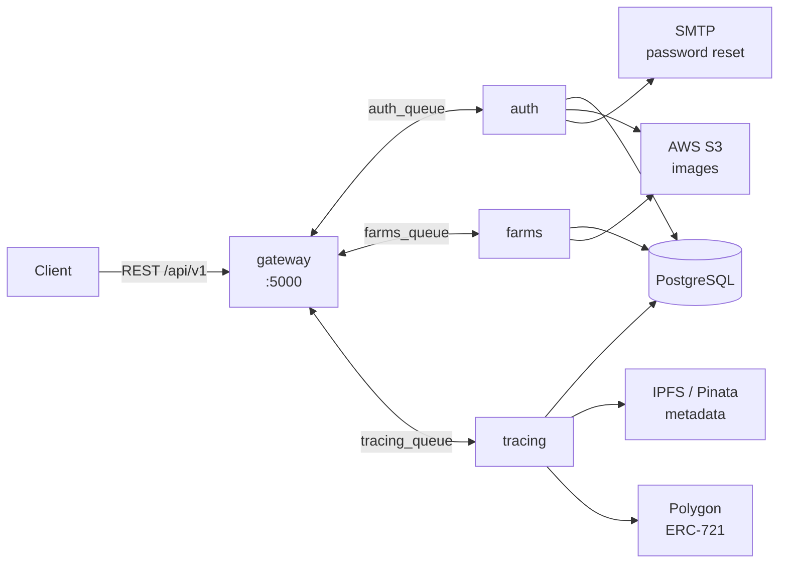

# HarvestLedger

An **agricultural traceability platform** built on NestJS microservices. It records a crop's full life cycle — sowing, treatments, harvest — and anchors that history in an immutable record: every farming event produces a new CID on IPFS, and the final harvest is minted as an ERC-721 NFT on Polygon.

The result is a verifiable chain of custody: a buyer can audit what was applied to a crop, when, and by whom, without having to take the producer's word for it.

---

## Why it's interesting

The substantial part isn't the CRUD — it's **how the metadata is chained**:

1. When traceability starts, the crop is serialized as NFT-style metadata and pinned to IPFS → yielding `CID₀`.
2. **Every recorded activity** (fertilizing, protection) fetches the current metadata, appends an attribute, and re-pins it → `CID₁`, `CID₂`, …
3. Registering the harvest repeats the process and mints the NFT, whose `tokenURI` points at the final CID.

Because IPFS is content-addressed, **any retroactive edit changes the hash** and breaks the chain. Immutability doesn't rest on trusting the backend.

---

## Architecture

Four independent NestJS services communicating over RabbitMQ in request/response mode. Only the gateway speaks HTTP.



| Service | Responsibility |
|---|---|
| **gateway** | The only HTTP surface. Validates, authenticates, and translates each request into a RabbitMQ message. Builds the exportable reports. |
| **auth** | Registration, login, JWT + refresh, password recovery by email, profile picture. |
| **farms** | Agricultural domain: farms, crops, activities, and harvests. The largest service. |
| **tracing** | Publishes metadata to IPFS and mints the harvest NFT on Polygon. |

`libs/common` holds the TypeORM entities, DTOs, guards, and shared modules (Postgres, RabbitMQ, S3, notifications).

### Domain model

```
User ──< Farm ──< Crop ──< Activity
                    └───── Harvest   (one per crop)
```

`Crop` is the pivot of the traceability chain: it stores `metadataLink` (the current IPFS CID) and `nftId` (the minted token, once harvested).

---

## Stack

**Backend** NestJS 10 (monorepo) · TypeScript · TypeORM · PostgreSQL
**Messaging** RabbitMQ (`amqplib`, `amqp-connection-manager`)
**Web3** ethers v6 · Polygon · ERC-721 (+ ERC-4906 for metadata updates)
**Storage** AWS S3 (images) · Pinata/IPFS (metadata)
**Other** JWT + bcrypt · Nodemailer + Handlebars · ExcelJS · Docker Compose

---

## Getting started

```bash
cp .env.example .env     # then fill in the values
docker compose up --build
```

| Service | URL |
|---|---|
| API | http://localhost:8086/api/v1 |
| Swagger | http://localhost:8086/api/docs |
| RabbitMQ console | http://localhost:15672 |
| pgAdmin | http://localhost:15432 |

Code documentation is generated with Compodoc:

```bash
pnpm install && pnpm doc
```

> The `tracing` service requires `WALLET_PRIVATE_KEY`, `CONTRACT_ADDRESS`, and `BLOCKCHAIN_RPC_URL`. Without them it fails fast at startup with an explicit message. The rest of the platform runs fine without any blockchain configuration.

---

## API

Every route is served under `/api/v1`. 🔒 = requires `Authorization: Bearer <token>`.

<details>
<summary><b>Authentication</b></summary>

| Method | Route | Description |
|---|---|---|
| POST | `auth/register` | Sign up |
| POST | `auth/login` | Log in → access (15m) + refresh (7d) |
| POST | `auth/refresh` | Reissue the access token |
| POST | `auth/forgot-password` | Sends an email with a 24h token |
| PATCH | `auth/reset-password` | Reset the password |
| POST | `auth/update` 🔒 | Update the profile |
| GET | `auth/user` 🔒 | Current profile |
| POST/GET | `auth/profile/photo` 🔒 | Profile picture |
</details>

<details>
<summary><b>Agricultural domain</b></summary>

| Method | Route | Description |
|---|---|---|
| POST/GET/PATCH/DELETE | `farms` 🔒 | Farm CRUD |
| POST/GET/PATCH/DELETE | `crops` 🔒 | Crop CRUD (`?farmId=`) |
| GET | `crops/findOne/:id` 🔒 | Crop detail |
| POST/GET/PATCH/DELETE | `activities` 🔒 | Activity CRUD (`?cropId=`) |
| POST/GET/PATCH/DELETE | `harvests` 🔒 | Harvest CRUD (`?cropId=`) |

Each resource also exposes `POST/GET .../photo` to upload and retrieve images (max 1 MB, `image/*` only).
</details>

<details>
<summary><b>Traceability and reports</b></summary>

| Method | Route | Description |
|---|---|---|
| PUT | `tracing/initTracing` 🔒 | Publishes the initial metadata to IPFS |
| POST | `tracing/updateTracing/:id` 🔒 | Uploads an image and mints the NFT once a harvest exists |
| GET | `report/admin` 🔒 | Global report (`admin` role only) |
| GET | `report/farmer/:id` 🔒 | The producer's own report |
</details>

---

## Layout

```
apps/
  gateway/    REST API · validation · Swagger · report generation
  auth/       users, JWT, email
  farms/      farms, crops, activities, harvests
  tracing/    IPFS + Polygon
libs/common/  entities, DTOs, guards, shared modules
```

---

## Project status

This project began as a startup product and is published here, anonymized, as a work sample. **It is not production ready**: it carries known technical debt, documented in [ROADMAP.md](./ROADMAP.md) — no test coverage, incomplete resource-ownership checks, and several coupling points between services.

That's stated plainly because a repository honest about its limits says more than one that hides them.

---

## License

No usage license. The code is published for portfolio and reference purposes; no rights of use, copying, or distribution are granted.
